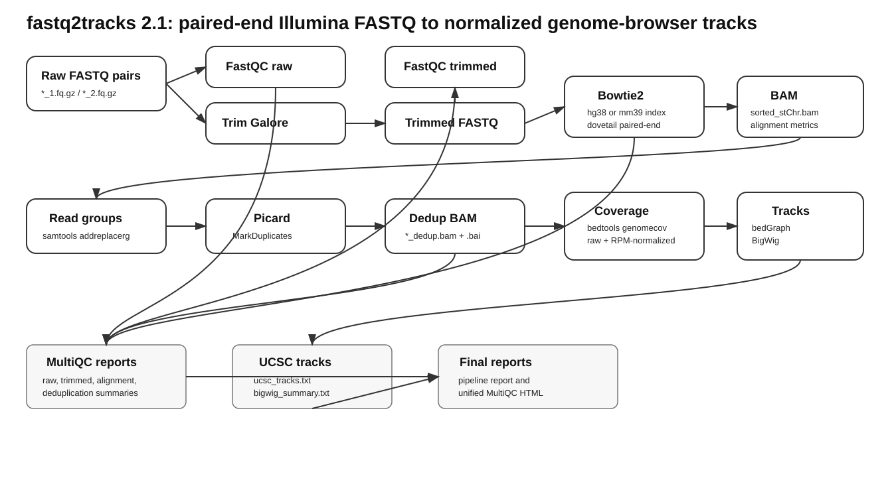

# fastq2tracks 2.1

`fastq2tracks` is a Bash workflow for turning paired-end Illumina DNA sequencing reads into normalized genome-browser coverage tracks. It starts with raw FASTQ files, performs QC and adapter trimming, aligns reads to a human or mouse reference genome with Bowtie2, removes duplicate alignments with Picard, builds raw and RPM-normalized coverage files, creates BigWig tracks, and produces pipeline and MultiQC reports.

The repository was prepared from the original workflow scripts without changing their contents. The added files around them are documentation, examples, checksums, and GitHub upload instructions.



## What the workflow produces

- Raw-read and trimmed-read FastQC reports.
- MultiQC reports for raw reads, trimmed reads, alignments, and deduplication metrics.
- Bowtie2 sorted BAM files and alignment metrics.
- Picard deduplicated BAM files and duplicate-removal metrics.
- Raw bedGraph coverage and RPM-normalized bedGraph coverage.
- BigWig files for genome-browser visualization.
- UCSC custom-track definitions and BigWig summary tables.
- R Markdown based pipeline execution reports.

## Repository layout

```text
scripts/          Original uploaded shell scripts, copied byte-for-byte
presentations/    Source PowerPoint deck from the lab meeting
docs/             GitHub documentation and workflow notes
examples/         Example run commands and placeholders
tests/            Lightweight syntax-check helper
```

## Quick start

Clone the repository, make the scripts executable, edit hard-coded paths for your server, and run the master workflow.

```bash
git clone https://github.com/<OWNER>/<REPOSITORY>.git
cd <REPOSITORY>
chmod +x scripts/*.sh

# Example human run
./scripts/fastq2tracks.2.1.sh /data/project/fastq /data/project/fastq2tracks_run 4 human

# Example mouse run
./scripts/fastq2tracks.2.1.sh /data/project/mouse_fastq /data/project/mouse_run 4 mouse
```

Important: the scripts currently contain absolute paths such as `/home/micgdu/workflows/RNAseq/scripts`. Either install the scripts at those paths or edit the paths before running. See [Installation and configuration](docs/INSTALLATION.md).

## Input naming assumptions

The main workflow assumes one paired-end sample per FASTQ pair. The most consistently supported raw-read pattern is:

```text
sample_1.fq.gz
sample_2.fq.gz
```

Some component scripts also attempt to support Illumina-style names such as `sample_R1_001.fastq.gz` and Trim Galore outputs such as `sample_1_val_1.fq.gz`. Read [Known issues and deployment notes](docs/KNOWN_ISSUES.md) before using these alternative names.

## Species support

The master script accepts a fourth argument:

```text
human  -> Bowtie2 hg38 index and hg38 chromosome sizes
mouse  -> Bowtie2 mm39 index and mm39 chromosome sizes
```

The relevant reference paths are hard-coded in `scripts/fastq2tracks.2.1.sh` and should be changed for a new system.

## Core command

```bash
./scripts/fastq2tracks.2.1.sh <input_fastq_folder> <output_folder> <max_jobs> <human|mouse>
```

Example:

```bash
./scripts/fastq2tracks.2.1.sh /dysk2/project/raw_fastq /dysk2/project/results 8 human
```

For crowded servers, use a smaller `max_jobs` value such as `2` or `4`. The lab meeting notes suggested `8` as a typical value for the original server.

## Documentation map

- [Workflow details](docs/WORKFLOW.md)
- [Script-by-script reference](docs/SCRIPTS.md)
- [Installation and configuration](docs/INSTALLATION.md)
- [Usage examples](docs/USAGE.md)
- [Outputs](docs/OUTPUTS.md)
- [Reporting and QC](docs/REPORTING_AND_QC.md)
- [Known issues and deployment notes](docs/KNOWN_ISSUES.md)
- [GitHub upload instructions](docs/GITHUB_UPLOAD.md)
- [Presentation text extract](docs/PRESENTATION_TEXT_EXTRACT.md)

## Validation included in this package

`SCRIPT_SYNTAX_CHECK.txt` contains the result of `bash -n` on every uploaded `.sh` file. All runnable shell scripts pass. `readme.2.1.sh` is intentionally flagged because it is a change-log note, not a runnable shell program.

`MANIFEST.sha256` records checksums for all packaged files.

## License

No license was selected while preparing this bundle. Add a license before making the repository public if you want others to reuse, modify, or redistribute the workflow.
