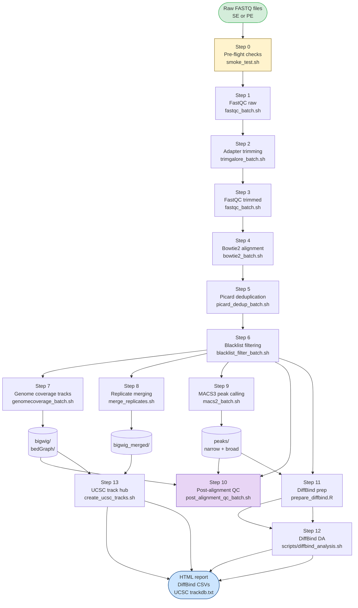

# ATACseq2tracks

> **ChIP-seq · ATAC-seq · CUT&RUN · CUT&TAG · ChIPmentation**
> A modular, checkpoint-based workflow from raw FASTQ to bigwig tracks, MACS3 peaks,
> deepTools post-alignment QC, and DiffBind-ready samplesheets.

[](CHANGELOG.md)
[]()
[](LICENSE)
[](environment.yml)

---

## Table of Contents

1. [Overview](#overview)
2. [How ATACseq2tracks relates to rnaseq2tracksP](#how-atacseq2tracks-relates-to-rnaseq2tracksp)
3. [Workflow diagram](#workflow-diagram)
4. [Repository layout](#repository-layout)
5. [Requirements](#requirements)
6. [Installation](#installation)
7. [Input files](#input-files)
   - [Samplesheet](#samplesheet)
   - [Configuration file](#configuration-file)
8. [Running the pipeline](#running-the-pipeline)
9. [Pipeline steps in detail](#pipeline-steps-in-detail)
10. [Output structure](#output-structure)
11. [Rerunning individual steps](#rerunning-individual-steps)
12. [Downstream analysis: DiffBind](#downstream-analysis-diffbind)
13. [Server resource tuning](#server-resource-tuning)
14. [Documentation](#documentation)
15. [Known issues and changelog](#known-issues-and-changelog)
16. [Citation](#citation)

---

## Overview

**ATACseq2tracks** processes raw FASTQ files from ChIP-seq and related chromatin-profiling assays through a complete, production-ready analysis pipeline:

| What it does | Tools used |
|---|---|
| Adapter trimming (SE and PE) | [Trim Galore](https://www.bioinformatics.babraham.ac.uk/projects/trim_galore/) v2.2+ |
| Read quality control | [FastQC](https://www.bioinformatics.babraham.ac.uk/projects/fastqc/) + [MultiQC](https://multiqc.info/) |
| Alignment to hg38 or mm39 | [Bowtie2](https://bowtie-bio.sourceforge.net/bowtie2/index.shtml) |
| Duplicate removal | [Picard MarkDuplicates](https://broadinstitute.github.io/picard/command-line-overview.html#MarkDuplicates) |
| Blacklist region filtering | [bedtools](https://bedtools.readthedocs.io/) intersect |
| Normalised bigwig track generation | [bedGraphToBigWig](https://hgdownload.soe.ucsc.edu/admin/exe/) + [samtools](http://www.htslib.org/) |
| Merged-replicate bigwig tracks | [samtools](http://www.htslib.org/) merge |
| Narrow and broad peak calling | [MACS3](https://macs3-project.github.io/MACS/) |
| Post-alignment QC (FRiP, PCA, correlation, karyogram) | [deepTools](https://deeptools.readthedocs.io/) + [samtools](http://www.htslib.org/) + [bedtools](https://bedtools.readthedocs.io/) |
| DiffBind samplesheet preparation | [R](https://www.r-project.org/) / [dplyr](https://dplyr.tidyverse.org/) |
| DiffBind differential accessibility analysis | [R](https://www.r-project.org/) / [DiffBind](https://bioconductor.org/packages/release/bioc/html/DiffBind.html) |
| UCSC track hub generation | [UCSC Genome Browser](https://genome.ucsc.edu/) trackDb |
| HTML pipeline report | bash |

A single CSV **samplesheet** drives the entire run. All parameters (paths, thread counts, reference files) live in one **config file**. A **checkpoint system** records each completed step so partial runs resume safely without re-processing finished work.

---

## How ATACseq2tracks relates to rnaseq2tracksP

Both pipelines share the same design philosophy — samplesheet-driven, config-file-parameterised, checkpoint-resumable — but target different assay types:

| | **ATACseq2tracks** | **rnaseq2tracksP** |
|---|---|---|
| Assay | ChIP-seq, ATAC-seq, CUT&RUN, CUT&TAG, ChIPmentation | RNA-seq |
| Alignment | Bowtie2 (gapped-free, short reads) | STAR or HISAT2 (splice-aware) |
| Duplicate removal | Picard MarkDuplicates | Optional (ribosomal depletion QC) |
| Peak calling | MACS3 (narrow + broad) | — |
| Track normalisation | Library-size (RPKM / spike-in) | TPM / CPM |
| QC module | deepTools (FRiP, fingerprint, PCA, correlation, karyogram) | RSeQC / MultiQC |
| Downstream prep | DiffBind samplesheets | DESeq2 / edgeR count matrices |
| Genome support | hg38, mm39 | hg38, mm39 |
| Config system | `config.conf` (bash source) | `config.conf` (bash source) |

The two workflows can be run on samples from the same experiment to jointly profile gene expression and chromatin state.

---

## Workflow diagram



---

## Repository layout

```
ATACseq2tracks/
├── atacseq2tracks.sh            ← Master script — this is what you run
├── environment.yml              ← Conda environment
├── CHANGELOG.md
├── CONTRIBUTING.md
├── LICENSE
├── README.md
│
├── config/
│   ├── config.conf              ← All paths, tool settings, thread counts
│   ├── samplesheet_template.csv ← Empty samplesheet with all column headers
│   └── samplesheet_example.csv  ← Populated example rows
│
├── docs/                        ← Full documentation (see Documentation section)
│   ├── README.md                ← Documentation index
│   ├── 01_overview.md
│   ├── 02_quickstart.md
│   ├── 03_installation.md
│   ├── 04_inputs.md
│   ├── 05_running.md
│   ├── 06_pipeline_steps.md
│   ├── 07_outputs.md
│   ├── 08_diffbind.md
│   ├── 09_troubleshooting.md
│   ├── 10_reference_files.md
│   ├── 11_blacklist_filtering.md
│   └── 12_post_alignment_qc.md  ← deepTools QC module documentation
│
└── scripts/
    ├── smoke_test.sh                  ← Pre-flight: tools, files, samplesheet
    ├── validate_samplesheet.py        ← CSV schema and logic validation
    ├── fastqc_batch.sh
    ├── trimgalore_batch.sh
    ├── bowtie2_align.sh               ← Single-sample wrapper
    ├── bowtie2_batch.sh               ← Samplesheet-driven batch
    ├── picard_dedup.sh                ← Single-sample wrapper
    ├── picard_dedup_batch.sh
    ├── blacklist_filter.sh            ← Single-sample wrapper
    ├── blacklist_filter_batch.sh
    ├── genomecoverage_single.sh       ← Single-sample bedGraph + bigwig
    ├── genomecoverage_batch.sh
    ├── merge_replicates.sh
    ├── macs2_peaks.sh                 ← Single-sample wrapper (calls macs3)
    ├── macs2_batch.sh
    ├── post_alignment_qc_batch.sh     ← deepTools QC orchestrator (Step 10)
    ├── plot_chrom_coverage.py         ← Chromosome karyogram plots
    ├── prepare_diffbind.R
    ├── create_ucsc_tracks.sh
    └── generate_pipeline_report.sh
```

> **Run from the parent directory** containing `ATACseq2tracks/` — not from inside the folder itself.

---

## Requirements

### Conda environment (recommended)

All command-line tools are managed via conda. See [Installation](#installation).

| Tool | Min version | Role | Homepage |
|---|---|---|---|
| [bowtie2](https://bowtie-bio.sourceforge.net/bowtie2/index.shtml) | 2.5 | Short-read alignment | bowtie-bio.sourceforge.net |
| [samtools](http://www.htslib.org/) | 1.18 | BAM sorting, indexing, merging | htslib.org |
| [bedtools](https://bedtools.readthedocs.io/) | 2.31 | Blacklist filtering, genome coverage, FRiP | bedtools.readthedocs.io |
| [Trim Galore](https://www.bioinformatics.babraham.ac.uk/projects/trim_galore/) | 2.2.0 | Adapter trimming, SE and PE | bioinformatics.babraham.ac.uk |
| [FastQC](https://www.bioinformatics.babraham.ac.uk/projects/fastqc/) | 0.12 | Per-sample read QC | bioinformatics.babraham.ac.uk |
| [MACS3](https://macs3-project.github.io/MACS/) | 3.0.4 | Peak calling (narrow + broad) | macs3-project.github.io |
| [MultiQC](https://multiqc.info/) | 1.20 | Aggregated QC HTML reports | multiqc.info |
| [Picard](https://broadinstitute.github.io/picard/) | 3.1 (`.jar`) | Duplicate marking | broadinstitute.github.io/picard |
| [deepTools](https://deeptools.readthedocs.io/) | 3.5+ | Post-alignment QC (Step 10) | deeptools.readthedocs.io |
| [bedGraphToBigWig](https://hgdownload.soe.ucsc.edu/admin/exe/) | UCSC kent | bigwig conversion | hgdownload.soe.ucsc.edu |
| [python3](https://www.python.org/) | 3.9+ | Samplesheet validation, karyogram plots | python.org |
| [matplotlib](https://matplotlib.org/) | 3.7+ | Chromosome coverage plots | matplotlib.org |
| [R](https://www.r-project.org/) | 4.3+ | DiffBind samplesheet preparation | r-project.org |

> **Note on MACS3:** The pipeline uses [MACS3](https://macs3-project.github.io/MACS/) (v3.0.4+), the fully Python-rewritten successor to MACS2. MACS3 uses an identical command-line interface and produces equivalent results, but is compatible with Python 3.11+ and modern glibc. Install via `pip install macs3`.

> **Note on deepTools:** Required for Step 10 (post-alignment QC). Install via conda: `mamba install deeptools>=3.5`.

### R / Bioconductor packages

R is only required for DiffBind (Step 11). The QC step uses deepTools and does not require R.

```r
BiocManager::install(c(
    "DiffBind", "BiocParallel",
    "GenomicAlignments", "rtracklayer"
))
install.packages(c("ggplot2", "dplyr"))
```

### Reference files

The following files must be present on your server and their paths set in `config.conf`:

| File | Config variable | Source |
|---|---|---|
| hg38 Bowtie2 index | `INDEX_HG38` | [UCSC / iGenomes](https://support.illumina.com/sequencing/sequencing_software/igenome.html) |
| mm39 Bowtie2 index | `INDEX_MM39` | UCSC / iGenomes |
| hg38 chrom sizes | `CHROM_SIZES_HUMAN` | `fetchChromSizes hg38` |
| mm39 chrom sizes | `CHROM_SIZES_MOUSE` | `fetchChromSizes mm39` |
| hg38 blacklist BED | `BLACKLIST_HG38` | [ENCODE ENCFF356LFX](https://www.encodeproject.org/files/ENCFF356LFX/) |
| mm39 blacklist BED | `BLACKLIST_MM39` | [excluderanges (Bioconductor)](https://bioconductor.org/packages/release/data/annotation/html/excluderanges.html) |
| deepTools QC threads | `THREADS_DEEPTOOLS` | Set in `config.conf` (e.g. `8`) |

See [Reference file preparation](docs/10_reference_files.md) for download commands.

---

## Installation

```bash
# 1. Clone the repository
git clone https://github.com/<username>/ATACseq2tracks.git ATACseq2tracks
cd ATACseq2tracks

# 2. Create and activate the conda environment
conda env create -f environment.yml
conda activate ATACseq2tracks

# 3. Install MACS3 (Python 3.11 compatible peak caller)
pip install macs3

# 4. Install deepTools if not already in environment.yml
mamba install -c bioconda deeptools>=3.5

# 5. Make scripts executable
chmod +x atacseq2tracks.sh scripts/*.sh scripts/*.py scripts/*.R

# Optional: install for all users on a shared Linux server
sudo mkdir -p /opt/ATACseq2tracks
sudo chown -R root:your_group /opt/ATACseq2tracks
sudo chmod -R a+rX /opt/ATACseq2tracks

# 6. Create a project directory and copy templates
mkdir -p /path/to/my_project/config
cp config/config.conf              /path/to/my_project/config/config.conf
cp config/samplesheet_template.csv /path/to/my_project/config/samplesheet.csv

# 7. Edit both files for your project
nano /path/to/my_project/config/config.conf
nano /path/to/my_project/config/samplesheet.csv
```

---

## Input files

### Samplesheet

The samplesheet is a **comma-separated CSV** with one row per sequencing library. Technical replicates (multiple sequencing runs of the same library) are handled by the `tech_replicate` column — they are merged automatically before trimming.

#### Column definitions

| # | Column | Type | Required | Description |
|---|---|---|---|---|
| 1 | `sample_id` | string | ✓ | Unique identifier for this library |
| 2 | `fastq_1` | path | ✓ | Absolute path to R1 FASTQ (`.fastq.gz`) |
| 3 | `fastq_2` | path | PE only | Absolute path to R2 FASTQ; leave empty for SE |
| 4 | `layout` | `SE`\|`PE` | ✓ | Single-end or paired-end |
| 5 | `genome` | `hg38`\|`mm39` | ✓ | Reference genome |
| 6 | `assay` | string | ✓ | e.g. `ChIP-seq`, `ATAC-seq`, `CUT&RUN`, `ChIPmentation` |
| 7 | `factor` | string | ✓ | Antibody target or histone mark (e.g. `H3K27ac`, `CTCF`) |
| 8 | `condition` | string | ✓ | Biological condition (e.g. `treated`, `day0`) |
| 9 | `treatment` | string | ✓ | Protocol or treatment (e.g. `DSG_FA`, `FA`, `none`) |
| 10 | `cell_type` | string | ✓ | Cell line or tissue (e.g. `NHEK`, `LymphocyteT`) |
| 11 | `replicate` | integer | ✓ | Biological replicate number (1, 2, 3, …) |
| 12 | `tech_replicate` | integer | ✓ | Technical replicate number; use `1` if only one run |
| 13 | `is_control` | `TRUE`\|`FALSE` | ✓ | `TRUE` for input / IgG control samples |
| 14 | `control_id` | string | IP only | `sample_id` of the matched control; empty for controls |
| 15 | `macs2_mode` | `both`\|`narrow`\|`broad`\|`none` | ✓ | Peak type(s) to call; use `none` for controls |
| 16 | `blacklist` | path | ✓ | Path to blacklist BED file for this genome |
| 17 | `output_prefix` | string | ✓ | Prefix used for output file naming |

> **Note:** The `chipqc_annotation` column (column 17 in earlier versions) has been removed.
> Post-alignment QC now uses deepTools and does not require pre-built R annotation objects.

#### Rules

- **Controls**: set `is_control=TRUE` and `macs2_mode=none`. The `control_id` column must be empty.
- **IP samples**: set `is_control=FALSE`. The `control_id` must match the `sample_id` of the control exactly.
- **Technical replicates**: add two rows with the same `sample_id` and `replicate` but `tech_replicate=1` and `tech_replicate=2`. They are merged before trimming.
- **Mixed genomes**: rows with `genome=hg38` and `genome=mm39` can coexist. Steps 8–11 loop over each genome separately.

See [Input files](docs/04_inputs.md) for the full column reference, validation rules, and example rows.

### Configuration file

Key parameters in `config.conf`:

```bash
SAMPLESHEET="/path/to/samplesheet.csv"
OUTPUT_DIR="/path/to/analysis/"

# Reference files
INDEX_HG38="/path/to/bowtie2_index/hg38"
CHROM_SIZES_HUMAN="/path/to/hs38n.chrom.sizes"
BLACKLIST_HG38="/path/to/blacklist_hg38_ENCFF356LFX.bed"
PICARD_JAR="/path/to/picard.jar"

# Thread settings
THREADS_PARALLEL_JOBS=8
THREADS_ALIGN=16
THREADS_SAMTOOLS=16
THREADS_TRIMGALORE=8
THREADS_FASTQC=10
THREADS_BIGWIG=16
THREADS_DEEPTOOLS=16    # deepTools QC (Step 10)
```

See [docs/04_inputs.md](docs/04_inputs.md#configuration-file) for the complete parameter reference.

---

## Running the pipeline

```bash
conda activate ATACseq2tracks

# Validate the samplesheet first
python3 ATACseq2tracks/scripts/validate_samplesheet.py /path/to/config/samplesheet.csv

# Run from the PARENT folder of ATACseq2tracks/
cd /path/to/parent_folder

nohup bash ATACseq2tracks/atacseq2tracks.sh \
    --config /path/to/my_project/config/config.conf \
    > /path/to/my_project/run.log 2>&1 &

echo $! > /path/to/my_project/run.pid
tail -f /path/to/my_project/run.log
```

See [Running the pipeline](docs/05_running.md) for monitoring, resuming, and partial reruns.

---

## Pipeline steps in detail

| Step | Script | What it does |
|---|---|---|
| 0 | `smoke_test.sh` | Pre-flight: tools, reference files, samplesheet |
| 1 | `fastqc_batch.sh` | FastQC on raw reads |
| 2 | `trimgalore_batch.sh` | Adapter trimming (SE and PE) |
| 3 | `fastqc_batch.sh` | FastQC on trimmed reads |
| 4 | `bowtie2_batch.sh` | Bowtie2 alignment |
| 5 | `picard_dedup_batch.sh` | Picard MarkDuplicates |
| 6 | `blacklist_filter_batch.sh` | Blacklist region removal |
| 7 | `genomecoverage_batch.sh` | Normalised bigwig tracks |
| 8 | `merge_replicates.sh` | Merged-replicate bigwig tracks |
| 9 | `macs2_batch.sh` | MACS3 peak calling (narrow + broad) |
| **10** | **`post_alignment_qc_batch.sh`** | **deepTools QC: FRiP, fingerprint, PCA, correlation, karyogram** |
| 11 | `prepare_diffbind.R` | DiffBind samplesheet preparation |
| 12 | `create_ucsc_tracks.sh` | UCSC track hub |
| 13 | `generate_pipeline_report.sh` | HTML pipeline report |

See [Pipeline steps](docs/06_pipeline_steps.md) for detailed documentation of each step.

---

## Output structure

```
<OUTPUT_DIR>/
├── .checkpoints/                    # Step completion flags (stepN.done)
│
├── fastQC/                          # Raw + trimmed FastQC HTMLs
├── multiQC/                         # MultiQC aggregated reports
├── trimmedFastq/                    # Trimmed FASTQs
├── bams/                            # Sorted, indexed BAMs (Bowtie2)
├── dedupBams/                       # <sample_id>_bioR<N>_dedup.bam
├── filteredBams/                    # <sample_id>_bioR<N>_dedup_blFilt.bam
├── bedGraph/                        # Raw coverage bedGraphs
├── NormBedGraph/                    # Library-size normalised bedGraphs
├── bigwig/                          # Per-replicate RPKM bigwig tracks
├── bigwig_peaknorm/                 # Peak-normalised bigwig tracks (DESeq2 consensus peak size factors)
├── bigwig_merged/                   # Condition-group merged bigwig tracks
│
├── peaks/
│   ├── per_replicate/<sample_id>/narrow/   # *.narrowPeak, *_summits.bed
│   ├── per_replicate/<sample_id>/broad/    # *.broadPeak
│   └── pooled/<group>/narrow/ + broad/
│
├── qc_post_alignment/               # deepTools QC outputs (Step 10)
│   ├── tables/
│   │   ├── qc_summary.tsv           # Per-sample: reads, dup%, mito%, peaks, FRiP
│   │   ├── qc_warnings.tsv          # Flagged samples with warning codes
│   │   └── frip_consensus.tsv       # FRiP over merged consensus peak set
│   ├── plots/
│   │   ├── chromosome_coverage/     # Per-sample karyogram PNGs
│   │   │   └── karyogram_all_samples.png
│   │   ├── fingerprint.png          # deepTools Lorenz curve
│   │   ├── correlation_heatmap_bins.png
│   │   ├── correlation_heatmap_peaks.png
│   │   ├── pca_bins.png
│   │   ├── pca_peaks.png
│   │   ├── heatmap_peaks.png
│   │   └── profile_peaks.png
│   ├── matrices/                    # multiBamSummary .npz + computeMatrix .gz
│   └── peak_sets/                   # merged_narrow.bed, consensus_peaks.bed
│
├── diffbind/                        # DiffBind samplesheets (narrow + broad)
├── logs/                            # Per-step log files

### Example: peak-normalised bigwig output

- `bigwig/` contains standard per-sample bigwig tracks normalized by library size (RPKM-style).
- `bigwig_peaknorm/` contains peak-normalised bigwig tracks scaled by DESeq2 size factors derived from counts over the shared consensus peak set.
- Use `bigwig_peaknorm/` when comparing signal across samples in the same experiment, because the scaling is anchored to consensus accessible regions rather than genome-wide coverage.

Example UCSC track line:

```text
track type=bigWig name="sample_peaknorm" description="Peak-normalised signal" bigDataUrl=https://your.server/path/to/bigwig_peaknorm/sample_bioR1_dedup_blFilt_peaknorm.bw
```

See [Pipeline steps](docs/06_pipeline_steps.md) for detailed documentation of each step.
│
└── reports/
    ├── ucsc_trackdb.txt
    └── pipeline_report_<YYYYMMDD>.html
```

See [Outputs](docs/07_outputs.md) for a full description of every file.

---

## Rerunning individual steps

Each step writes a checkpoint file `<OUTPUT_DIR>/.checkpoints/stepN.done` when it completes. To rerun any step, delete its checkpoint and re-execute the master script — all earlier completed steps will be skipped.

```bash
# Rerun step 10 (deepTools QC) only
rm /path/to/analysis/.checkpoints/step10.done
nohup bash ATACseq2tracks/atacseq2tracks.sh \
    --config /path/to/config/config.conf \
    >> run_rerun.log 2>&1 &

# Rerun steps 9 through 13 (e.g. after updating peak calling)
rm /path/to/analysis/.checkpoints/step{9,10,11,12,13}.done

# Rerun everything from scratch
rm -rf /path/to/analysis/.checkpoints/
```

---

## Downstream analysis: DiffBind

After the pipeline completes, two DiffBind-compatible samplesheets are ready in `diffbind/` for each genome:

```r
library(DiffBind)

# Sharp marks (H3K27ac, H3K4me3, CTCF)
dba <- dba(sampleSheet = "diffbind/diffbind_samplesheet_hg38_narrow.csv")

# Broad marks (H3K27me3, H3K9me3, H3K36me3)
dba <- dba(sampleSheet = "diffbind/diffbind_samplesheet_hg38_broad.csv")

# Standard DiffBind workflow
dba <- dba.count(dba)
dba <- dba.normalize(dba)
dba <- dba.contrast(dba, categories = DBA_CONDITION)
dba <- dba.analyze(dba)
dba.report(dba)
```

See [Downstream: DiffBind](docs/08_diffbind.md) for the full guide.

---

## Server resource tuning

Tested configuration: 70 physical cores / 140 logical threads / 500 GB RAM.

| Config variable | Role | Recommended | Notes |
|---|---|---|---|
| `THREADS_PARALLEL_JOBS` | Samples processed in parallel | `8` | Each sample uses `THREADS_ALIGN` threads |
| `THREADS_ALIGN` | Bowtie2 threads per sample | `16` | Peak load = `PARALLEL_JOBS × ALIGN` = 128 |
| `THREADS_SAMTOOLS` | samtools sort/index threads | `16` | |
| `THREADS_TRIMGALORE` | TrimGalore cores per sample | `8` | |
| `THREADS_FASTQC` | FastQC `-t` per batch call | `10` | |
| `THREADS_BIGWIG` | bedtools/samtools for coverage | `16` | |
| `THREADS_DEEPTOOLS` | deepTools workers (Step 10) | `16` | Used by `multiBamSummary`, `bamCoverage` |

For smaller servers (e.g. 16 cores), use `THREADS_PARALLEL_JOBS=2`, `THREADS_ALIGN=8`, `THREADS_DEEPTOOLS=8`.

---

## Documentation

Full documentation is available in the [`docs/`](docs/) directory.

| | |
|---|---|
| 🗂 [Documentation index](docs/README.md) | All docs pages |
| 🚀 [Quick start](docs/02_quickstart.md) | Get running in 5 steps |
| 📋 [Samplesheet format](docs/04_inputs.md) | Column reference and examples |
| 🔧 [Configuration](docs/04_inputs.md#configuration-file) | All config parameters |
| 🔬 [Pipeline steps](docs/06_pipeline_steps.md) | Every step explained in detail |
| 📊 [Outputs](docs/07_outputs.md) | What files are produced and how to read them |
| 🧬 [DiffBind downstream](docs/08_diffbind.md) | Differential binding analysis |
| 🚫 [Blacklist filtering](docs/11_blacklist_filtering.md) | How filtering works, blacklist sources and references |
| 🔍 [Post-alignment QC](docs/12_post_alignment_qc.md) | deepTools QC module: FRiP, fingerprint, PCA, correlation, karyogram |
| 🛠 [Troubleshooting](docs/09_troubleshooting.md) | Common errors and fixes |
| 📚 [Reference file preparation](docs/10_reference_files.md) | Bowtie2 indices, blacklist BED files |

---

## Known issues and changelog

### v3.1.0 (2026-06-05) — current

| Change | Details |
|---|---|
| **QC module replaced** | ChIPQC (Bioconductor) replaced by deepTools-based `post_alignment_qc_batch.sh` + `plot_chrom_coverage.py` |
| **New outputs** | `qc_post_alignment/` — FRiP table, fingerprint, PCA, correlation heatmaps, karyogram plots, consensus peaks |
| **Zero-peak safety** | Samples with no peaks are retained in QC summaries and flagged `NO_PEAKS`; never silently dropped |
| **R no longer required for QC** | `CHIPQC_ANNOTATION_*` and `CHIPQC_BLACKLIST_*_RDS` config variables deprecated |
| **New config variable** | `THREADS_DEEPTOOLS` required in `config.conf` |
| **Samplesheet column removed** | `chipqc_annotation` column (col 17) removed; column count reduced to 17 |
| **ChIPmentation added** | Explicitly listed as supported assay type |
| **Documentation** | `docs/12_post_alignment_qc.md` added; all other doc pages updated |

### v3.0.4 (2026-05-27)

| Issue | Fix |
|---|---|
| `THREADS_BOWTIE2: unbound variable` | Renamed to `THREADS_ALIGN` throughout |
| `trim_galore: unknown option -o` | Changed to `--output_dir` (TrimGalore v2.2.0 Oxidized Edition) |
| Trimmed files not renamed correctly | Stem computed from input filename, not temp path |
| Picard batch scanned wrong BAM glob | Fixed from `*.sorted_stChr.bam` to `*.bam` |
| `samtools sort: failed to read header` | Downstream of `THREADS_ALIGN` fix |
| Steps 6–13 skipped all samples | BAM filenames include `_bioRN` suffix; lookup keys updated in all downstream scripts |
| Missing closing `}` in `_load_config` and `wait_for_slot` | Fixed in `blacklist_filter_batch.sh` |
| `ctrl_rep` undefined in `macs2_batch.sh` | Pre-built `sid_rep[]` lookup map added |
| Bare `replicate` variable in R scripts | Changed to `ss$replicate[i]` / `ss_ip$replicate[i]` |
| MACS2 `ImportError: undefined symbol: __log_finite` | Replaced with MACS3 v3.0.4 (`pip install macs3`); identical CLI, Python 3.11 compatible |

### v3.0.0 (2026-05-19)

- Added SE read support, blacklist filtering, replicate and control tracking
- Added MACS2 narrow + broad peak calling, ChIPQC module, DiffBind preparation
- Added checkpoint system, `environment.yml`, samplesheet validator
- Unified config file replacing per-genome hardcoded scripts

### v2.1 (archived in `scripts/legacy/`)

Original version supporting PE reads and two separate genome-specific batch scripts.

---

## Citation

> If you use ATACseq2tracks in your work, please cite the tools it depends on:

- **Bowtie2:** Langmead & Salzberg, *Nature Methods* 9:357–359 (2012). DOI: [10.1038/nmeth.1923](https://doi.org/10.1038/nmeth.1923)
- **Picard:** Broad Institute. https://broadinstitute.github.io/picard/
- **MACS3:** Zhang et al., *Genome Biology* 9:R137 (2008). DOI: [10.1186/gb-2008-9-9-r137](https://doi.org/10.1186/gb-2008-9-9-r137)
- **deepTools:** Ramírez et al., *Nucleic Acids Research* 44:W160–W165 (2016). DOI: [10.1093/nar/gkw257](https://doi.org/10.1093/nar/gkw257)
- **bedtools:** Quinlan & Hall, *Bioinformatics* 26:841–842 (2010). DOI: [10.1093/bioinformatics/btq033](https://doi.org/10.1093/bioinformatics/btq033)
- **Blacklist (ENCODE):** Amemiya et al., *Scientific Reports* 9:9354 (2019). DOI: [10.1038/s41598-019-45839-z](https://doi.org/10.1038/s41598-019-45839-z)
- **DiffBind:** Ross-Innes et al., *Nature* 481:389–393 (2012). DOI: [10.1038/nature10730](https://doi.org/10.1038/nature10730)
