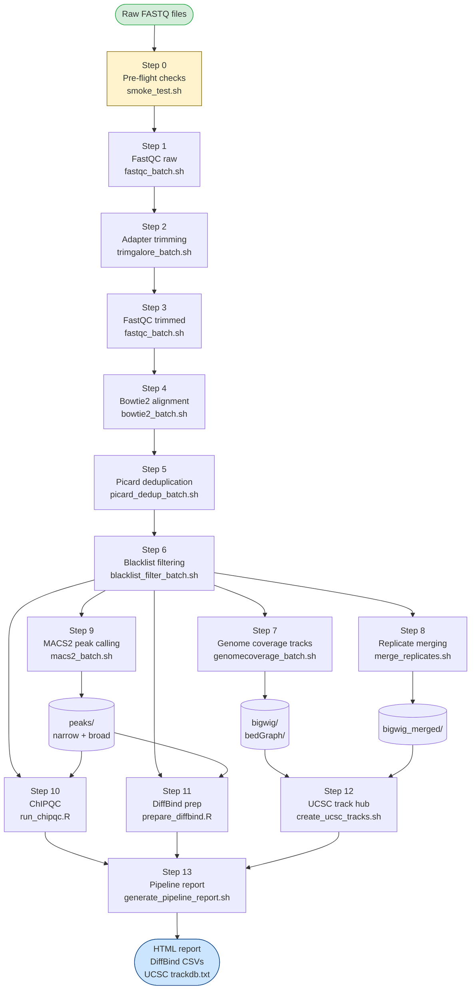

# fastq2tracks

> **ChIP-seq · ATAC-seq · CUT&RUN · CUT&TAG**
> A modular, checkpoint-based workflow from raw FASTQ to bigwig tracks, MACS2 peaks, ChIPQC reports, and DiffBind-ready samplesheets.

[](CHANGELOG.md)
[]()
[](LICENSE)
[](environment.yml)

---

## Table of Contents

1. [Overview](#overview)
2. [How fastq2tracks relates to rnaseq2tracksP](#how-fastq2tracks-relates-to-rnaseq2tracksp)
3. [Workflow diagram](#workflow-diagram)
4. [Repository layout](#repository-layout)
5. [Requirements](#requirements)
6. [Installation](#installation)
7. [Input files](#input-files)
   - [Samplesheet](#samplesheet)
   - [Configuration file](#configuration-file)
8. [Running the pipeline](#running-the-pipeline)
9. [Pipeline steps in detail](#pipeline-steps-in-detail)
10. [Output structure](#output-structure)
11. [Rerunning individual steps](#rerunning-individual-steps)
12. [Downstream analysis: DiffBind](#downstream-analysis-diffbind)
13. [Server resource tuning](#server-resource-tuning)
14. [Known issues and changelog](#known-issues-and-changelog)
15. [Citation](#citation)

---

## Overview

**fastq2tracks** processes raw FASTQ files from ChIP-seq and related chromatin-profiling assays through a complete, production-ready analysis pipeline:

| What it does | Tools used |
|---|---|
| Adapter trimming (SE and PE) | Trim Galore v2.2+ |
| Read quality control | FastQC + MultiQC |
| Alignment to hg38 or mm39 | Bowtie2 |
| Duplicate removal | Picard MarkDuplicates |
| Blacklist region filtering | bedtools |
| Normalised bigwig track generation | bedGraphToBigWig + samtools |
| Merged-replicate bigwig tracks | samtools merge |
| Narrow and broad peak calling | MACS2 |
| ChIP-seq quality assessment | ChIPQC (Bioconductor) |
| DiffBind samplesheet preparation | R / dplyr |
| UCSC track hub generation | bash |
| HTML pipeline report | bash |

A single CSV **samplesheet** drives the entire run. All parameters (paths, thread counts, reference files) live in one **config file**. A **checkpoint system** records each completed step so partial runs resume safely without re-processing finished work.

---

## How fastq2tracks relates to rnaseq2tracksP

Both pipelines share the same design philosophy — samplesheet-driven, config-file-parameterised, checkpoint-resumable — but target different assay types:

| | **fastq2tracks** | **rnaseq2tracksP** |
|---|---|---|
| Assay | ChIP-seq, ATAC-seq, CUT&RUN, CUT&TAG | RNA-seq |
| Alignment | Bowtie2 (gapped-free, short reads) | STAR or HISAT2 (splice-aware) |
| Duplicate removal | Picard MarkDuplicates | Optional (ribosomal depletion QC) |
| Peak calling | MACS2 (narrow + broad) | — |
| Track normalisation | Library-size (RPKM / spike-in) | TPM / CPM |
| QC module | ChIPQC | RSeQC / MultiQC |
| Downstream prep | DiffBind samplesheets | DESeq2 / edgeR count matrices |
| Genome support | hg38, mm39 | hg38, mm39 |
| Config system | `config.conf` (bash source) | `config.conf` (bash source) |

The two workflows can be run on samples from the same experiment to jointly profile gene expression and chromatin state.

---

## Workflow diagram



---

## Repository layout

```
fastq2tracks/
├── fastq2tracks.sh              ← Master script — this is what you run
├── environment.yml              ← Conda environment
├── CHANGELOG.md
├── LICENSE
├── README.md
│
├── config/
│   ├── config.conf              ← All paths, tool settings, thread counts
│   ├── samplesheet_template.csv ← Empty samplesheet with all column headers
│   └── samplesheet_example.csv  ← Populated example rows
│
└── scripts/
    ├── smoke_test.sh            ← Pre-flight: tools, files, samplesheet
    ├── validate_samplesheet.py  ← CSV schema and logic validation
    ├── fastqc_batch.sh
    ├── trimgalore_batch.sh
    ├── bowtie2_align.sh         ← Single-sample wrapper
    ├── bowtie2_batch.sh         ← Samplesheet-driven batch
    ├── picard_dedup.sh          ← Single-sample wrapper
    ├── picard_dedup_batch.sh
    ├── blacklist_filter.sh      ← Single-sample wrapper
    ├── blacklist_filter_batch.sh
    ├── genomecoverage_single.sh ← Single-sample bedGraph + bigwig
    ├── genomecoverage_batch.sh
    ├── merge_replicates.sh
    ├── macs2_peaks.sh           ← Single-sample wrapper
    ├── macs2_batch.sh
    ├── run_chipqc.R
    ├── prepare_diffbind.R
    ├── create_ucsc_tracks.sh
    └── generate_pipeline_report.sh
```

> **Run from the parent directory** containing `fastq2tracks/` — not from inside the folder itself.

---

## Requirements

### Conda environment (recommended)

All command-line tools are managed via conda. See [Installation](#installation).

| Tool | Minimum version | Role |
|---|---|---|
| bowtie2 | 2.5 | Alignment |
| samtools | 1.18 | BAM processing and sorting |
| bedtools | 2.31 | Blacklist filtering, coverage |
| trim_galore | 2.2.0 (Oxidized Edition) | Adapter trimming, SE and PE |
| fastqc | 0.12 | Per-sample read QC |
| macs2 | 2.2.9 | Peak calling |
| multiqc | 1.20 | Aggregated QC reports |
| picard | 3.1 (`.jar`) | Duplicate marking |
| bedGraphToBigWig | UCSC kent | bigwig conversion |
| python3 | 3.9+ | Samplesheet validation |
| R | 4.3+ | ChIPQC, DiffBind preparation |

### R / Bioconductor packages

```r
BiocManager::install(c(
    "ChIPQC", "DiffBind", "BiocParallel",
    "GenomicAlignments", "rtracklayer"
))
install.packages(c("ggplot2", "dplyr"))
```

### Reference files

The following files must be present on your server and their paths set in `config.conf`:

| File | Config variable | Source |
|---|---|---|
| hg38 Bowtie2 index | `INDEX_HG38` | [UCSC / iGenomes](https://support.illumina.com/sequencing/sequencing_software/igenome.html) |
| mm39 Bowtie2 index | `INDEX_MM39` | UCSC / iGenomes |
| hg38 chrom sizes | `CHROM_SIZES_HUMAN` | `fetchChromSizes hg38` |
| mm39 chrom sizes | `CHROM_SIZES_MOUSE` | `fetchChromSizes mm39` |
| hg38 blacklist BED | `BLACKLIST_HG38` | [ENCODE ENCFF356LFX](https://www.encodeproject.org/files/ENCFF356LFX/) |
| mm39 blacklist BED | `BLACKLIST_MM39` | [Boyle lab](https://github.com/Boyle-Lab/Blacklist) |
| hg38 ChIPQC annotation RDS | `CHIPQC_ANNOTATION_HG38` | Pre-built from `TxDb.Hsapiens.UCSC.hg38.knownGene` |
| mm39 ChIPQC annotation RDS | `CHIPQC_ANNOTATION_MM39` | Pre-built from `TxDb.Mmusculus.UCSC.mm39.refGene` |
| hg38 ChIPQC blacklist RDS | `CHIPQC_BLACKLIST_HG38_RDS` | Converted from BED via `rtracklayer::import` |
| mm39 ChIPQC blacklist RDS | `CHIPQC_BLACKLIST_MM39_RDS` | Converted from BED via `rtracklayer::import` |

---

## Installation

```bash
# 1. Clone the repository
git clone https://github.com/MichalGd/fastq2tracks.git
cd fastq2tracks

# 2. Create and activate the conda environment
conda env create -f environment.yml
conda activate fastq2tracks

# 3. Make scripts executable
chmod +x fastq2tracks.sh scripts/*.sh scripts/*.py scripts/*.R

# 4. Create a project directory and copy templates
mkdir -p /path/to/my_project/config
cp config/config.conf              /path/to/my_project/config/config.conf
cp config/samplesheet_template.csv /path/to/my_project/config/samplesheet.csv

# 5. Edit both files for your project
nano /path/to/my_project/config/config.conf
nano /path/to/my_project/config/samplesheet.csv
```

---

## Input files

### Samplesheet

The samplesheet is a **comma-separated CSV** with one row per sequencing library. Technical replicates (multiple sequencing runs of the same library) are handled by the `tech_replicate` column — they are merged automatically before trimming.

#### Column definitions

| # | Column | Type | Required | Description |
|---|---|---|---|---|
| 1 | `sample_id` | string | ✓ | Unique identifier for this library |
| 2 | `fastq_1` | path | ✓ | Absolute path to R1 FASTQ (`.fastq.gz`) |
| 3 | `fastq_2` | path | PE only | Absolute path to R2 FASTQ; leave empty for SE |
| 4 | `layout` | `SE`\|`PE` | ✓ | Single-end or paired-end |
| 5 | `genome` | `hg38`\|`mm39` | ✓ | Reference genome |
| 6 | `assay` | string | ✓ | e.g. `ChIP-seq`, `ATAC-seq`, `CUT&RUN` |
| 7 | `factor` | string | ✓ | Antibody target or histone mark (e.g. `H3K27ac`, `CTCF`) |
| 8 | `condition` | string | ✓ | Biological condition (e.g. `treated`, `day0`) |
| 9 | `treatment` | string | ✓ | Protocol or treatment (e.g. `DSG_FA`, `FA`, `none`) |
| 10 | `cell_type` | string | ✓ | Cell line or tissue (e.g. `NHEK`, `LymphocyteT`) |
| 11 | `replicate` | integer | ✓ | Biological replicate number (1, 2, 3, …) |
| 12 | `tech_replicate` | integer | ✓ | Technical replicate number; use `1` if only one run |
| 13 | `is_control` | `TRUE`\|`FALSE` | ✓ | `TRUE` for input / IgG control samples |
| 14 | `control_id` | string | IP only | `sample_id` of the matched control; empty for controls |
| 15 | `macs2_mode` | `both`\|`narrow`\|`broad`\|`none` | ✓ | Peak type(s) to call; use `none` for controls |
| 16 | `blacklist` | path | ✓ | Path to blacklist BED file for this genome |
| 17 | `chipqc_annotation` | path | ✓ | Path to ChIPQC annotation RDS for this genome |
| 18 | `output_prefix` | string | ✓ | Prefix used for output file naming |

#### Rules

- **Controls**: set `is_control=TRUE` and `macs2_mode=none`. The `control_id` column must be empty.
- **IP samples**: set `is_control=FALSE`. The `control_id` must match the `sample_id` of the control exactly.
- **Technical replicates**: add two rows with the same `sample_id` and `replicate` but `tech_replicate=1` and `tech_replicate=2`. They are merged before trimming.
- **Mixed genomes**: rows with `genome=hg38` and `genome=mm39` can coexist. Steps 8–11 loop over each genome separately.

#### Minimal example

```csv
sample_id,fastq_1,fastq_2,layout,genome,assay,factor,condition,treatment,cell_type,replicate,tech_replicate,is_control,control_id,macs2_mode,blacklist,chipqc_annotation,output_prefix
NHEK_Input_bioR1,/data/NHEK_Input.fastq.gz,,SE,hg38,ChIP-seq,Input,day0,none,NHEK,1,1,TRUE,,none,/ref/blacklist_hg38.bed,/ref/anno_hg38.rds,NHEK_Input_bioR1
NHEK_H3K27ac_day0_bioR1,/data/NHEK_H3K27ac_d0.fastq.gz,,SE,hg38,ChIP-seq,H3K27ac,day0,none,NHEK,1,1,FALSE,NHEK_Input_bioR1,both,/ref/blacklist_hg38.bed,/ref/anno_hg38.rds,NHEK_H3K27ac_day0_bioR1
Tco_rest_1_SATB1_bioR1,/data/Tco_SATB1_R1.fastq.gz,/data/Tco_SATB1_R2.fastq.gz,PE,hg38,ChIP-seq,SATB1,rest,DSG_FA,LymphocyteT,1,1,FALSE,Tco_rest_1_Input_bioR1,both,/ref/blacklist_hg38.bed,/ref/anno_hg38.rds,Tco_rest_1_SATB1_bioR1
```

> Validate the samplesheet before running:
> ```bash
> python3 scripts/validate_samplesheet.py /path/to/config/samplesheet.csv
> ```

---

### Configuration file

Copy `config/config.conf` and edit for your server. All parameters are documented inline.

#### Key variables

| Variable | Description | Example |
|---|---|---|
| `SAMPLESHEET` | Path to samplesheet CSV | `/path/to/config/samplesheet.csv` |
| `OUTPUT_DIR` | Root output directory | `/path/to/analysis/` |
| `INDEX_HG38` | Bowtie2 index prefix for hg38 | `/ref/bowtie2/hg38` |
| `INDEX_MM39` | Bowtie2 index prefix for mm39 | `/ref/bowtie2/mm39` |
| `CHROM_SIZES_HUMAN` | hg38 chromosome sizes | `/ref/hs38n.chrom.sizes` |
| `CHROM_SIZES_MOUSE` | mm39 chromosome sizes | `/ref/mm39n.chrom.sizes` |
| `BLACKLIST_HG38` | hg38 blacklist BED | `/ref/blacklist_hg38_ENCFF356LFX.bed` |
| `BLACKLIST_MM39` | mm39 blacklist BED | `/ref/blacklist_mm39_Boyle.bed` |
| `CHIPQC_ANNOTATION_HG38` | hg38 ChIPQC annotation RDS | `/ref/anno_hg38_chipqc.rds` |
| `CHIPQC_ANNOTATION_MM39` | mm39 ChIPQC annotation RDS | `/ref/anno_mm39_chipqc.rds` |
| `CHIPQC_BLACKLIST_HG38_RDS` | hg38 ChIPQC blacklist RDS | `/ref/blacklist_hg38.rds` |
| `CHIPQC_BLACKLIST_MM39_RDS` | mm39 ChIPQC blacklist RDS | `/ref/blacklist_mm39.rds` |
| `PICARD_JAR` | Full path to `picard.jar` | `/software/picard.jar` |
| `R_BIN` | Rscript binary | `Rscript` |
| `THREADS_PARALLEL_JOBS` | Max samples processed simultaneously | `8` |
| `THREADS_ALIGN` | Bowtie2 `-p` threads per sample | `16` |
| `THREADS_SAMTOOLS` | samtools `-@` threads | `16` |
| `THREADS_TRIMGALORE` | TrimGalore `--cores` | `8` |
| `THREADS_FASTQC` | FastQC `-t` | `10` |
| `THREADS_BIGWIG` | bedtools/samtools for bigwig | `16` |
| `THREADS_CHIPQC` | BiocParallel workers for ChIPQC | `20` |
| `KEEP_INTERMEDIATE_BAMS` | Keep pre-dedup BAMs | `false` |
| `KEEP_TRIMMED_FASTQ` | Keep trimmed FASTQs | `false` |

---

## Running the pipeline

### Full run

```bash
# 1. Activate environment
conda activate fastq2tracks

# 2. (Optional) Validate samplesheet
python3 /path/to/fastq2tracks/scripts/validate_samplesheet.py \
    /path/to/my_project/config/samplesheet.csv

# 3. Launch pipeline (from the PARENT folder of fastq2tracks/)
cd /path/to/parent_folder
nohup bash fastq2tracks/fastq2tracks.sh \
    --config /path/to/my_project/config/config.conf \
    > /path/to/my_project/run.log 2>&1 &

# Save the process ID
echo $! > /path/to/my_project/run.pid

# Monitor progress
tail -f /path/to/my_project/run.log
```

### Resume an interrupted run

```bash
# Steps that completed are skipped automatically — just re-run the same command
nohup bash fastq2tracks/fastq2tracks.sh \
    --config /path/to/my_project/config/config.conf \
    >> /path/to/my_project/run_resume.log 2>&1 &
```

### Run with a different config (second project)

```bash
nohup bash fastq2tracks/fastq2tracks.sh \
    --config /path/to/project_B/config/config.conf \
    > /path/to/project_B/run.log 2>&1 &
```

---

## Pipeline steps in detail

| Step | Script | Input | Output | Notes |
|---|---|---|---|---|
| 0 — Pre-flight | `smoke_test.sh` | config + samplesheet | Pass/fail report | Checks tools, reference files, R packages, disk space |
| 1 — FastQC raw | `fastqc_batch.sh` | raw FASTQs | `fastQC/fastQC_unTrimmed/` + MultiQC | Parallel, `THREADS_FASTQC` per sample |
| 2 — Trimming | `trimgalore_batch.sh` | raw FASTQs | `trimmedFastq/` | SE and PE; merges technical replicates before trimming |
| 3 — FastQC trimmed | `fastqc_batch.sh` | trimmed FASTQs | `fastQC/fastQC_trimmed/` + MultiQC | |
| 4 — Alignment | `bowtie2_batch.sh` | trimmed FASTQs | `bams/*.bam` + MultiQC | Dispatches `bowtie2_align.sh`; handles hg38 and mm39 per-row |
| 5 — Deduplication | `picard_dedup_batch.sh` | `bams/` | `dedupBams/<id>_bioR<N>_dedup.bam` + MultiQC | Adds RG tags first; output name includes `_bioR<replicate>` |
| 6 — Blacklist filter | `blacklist_filter_batch.sh` | `dedupBams/` | `filteredBams/<id>_bioR<N>_dedup_blFilt.bam` | Uses blacklist path from samplesheet column 16 |
| 7 — Coverage tracks | `genomecoverage_batch.sh` | `filteredBams/` | `bigwig/*.bw`, `bedGraph/`, `NormBedGraph/` | Library-size normalised; spike-in normalisation if configured |
| 8 — Merged tracks | `merge_replicates.sh` | `filteredBams/` | `bigwig_merged/*.bw` | Groups by `factor__condition__treatment__cell_type__genome` |
| 9 — Peak calling | `macs2_batch.sh` | `filteredBams/` | `peaks/per_replicate/` + `peaks/pooled/` | Always runs both narrow and broad; uses `control_id` linkage |
| 10 — ChIPQC | `run_chipqc.R` | filtered BAMs + peaks | `chipqc/ChIPQC_<genome>_<mode>/` | BiocParallel; runs twice (narrow + broad) per genome |
| 11 — DiffBind prep | `prepare_diffbind.R` | filtered BAMs + peaks | `diffbind/diffbind_samplesheet_<genome>_<mode>.csv` | Two CSVs per genome |
| 12 — UCSC tracks | `create_ucsc_tracks.sh` | `bigwig/` + `bigwig_merged/` | `reports/ucsc_trackdb.txt` | Points to bigwig files on a user-configured web server |
| 13 — Report | `generate_pipeline_report.sh` | all outputs | `reports/pipeline_report_<date>.html` | Summary of all outputs with QC metrics |

---

## Output structure

```
<OUTPUT_DIR>/
├── .checkpoints/                    # Step completion flags (stepN.done)
│
├── fastQC/
│   ├── fastQC_unTrimmed/            # Raw read FastQC HTMLs + zips
│   └── fastQC_trimmed/              # Post-trim FastQC HTMLs + zips
│
├── multiQC/
│   ├── multiQC_unTrimmed/           # MultiQC report for raw reads
│   ├── multiQC_trimmed/             # MultiQC report for trimmed reads
│   ├── multiQC_alignments/          # Bowtie2 alignment stats
│   └── multiQC_deduplication/       # Picard duplication metrics
│
├── trimmedFastq/                    # *_trimmed.fq.gz (SE) | *_val_1/2.fq.gz (PE)
│
├── bams/                            # <sample_id>.bam + .bai (sorted, indexed)
├── dedupBams/                       # <sample_id>_bioR<N>_dedup.bam
├── filteredBams/                    # <sample_id>_bioR<N>_dedup_blFilt.bam
│
├── bedGraph/                        # Raw coverage bedGraphs
├── NormBedGraph/                    # Spike-normalised bedGraphs (if applicable)
│
├── bigwig/                          # Per-replicate RPKM-normalised bigwig tracks
├── bigwig_merged/                   # Condition-group merged bigwig tracks
│
├── peaks/
│   ├── per_replicate/
│   │   └── <sample_id>/
│   │       ├── narrow/              # *_peaks.narrowPeak, *_summits.bed
│   │       └── broad/               # *_peaks.broadPeak
│   └── pooled/
│       └── <factor>__<condition>__<treatment>__<cell_type>__<genome>/
│           ├── narrow/
│           └── broad/
│
├── chipqc/
│   ├── ChIPQC_hg38_narrow/          # HTML report + metrics CSVs
│   ├── ChIPQC_hg38_broad/
│   ├── ChIPQC_mm39_narrow/          # (only if mm39 samples present)
│   └── ChIPQC_mm39_broad/
│
├── diffbind/
│   ├── diffbind_samplesheet_hg38_narrow.csv
│   ├── diffbind_samplesheet_hg38_broad.csv
│   ├── diffbind_samplesheet_mm39_narrow.csv  # (if mm39 samples present)
│   └── diffbind_samplesheet_mm39_broad.csv
│
├── logs/                            # Per-step and per-sample log files
│
└── reports/
    ├── ucsc_trackdb.txt
    └── pipeline_report_<YYYYMMDD>.html
```

---

## Rerunning individual steps

Each step writes a checkpoint file `<OUTPUT_DIR>/.checkpoints/stepN.done` when it completes. To rerun any step, delete its checkpoint and re-execute the master script — all earlier completed steps will be skipped.

```bash
# Rerun step 9 (MACS2 peak calling) only
rm /path/to/analysis/.checkpoints/step9.done
nohup bash fastq2tracks/fastq2tracks.sh \
    --config /path/to/config/config.conf \
    >> run_rerun.log 2>&1 &

# Rerun steps 6 through 13 (e.g. after updating blacklist)
rm /path/to/analysis/.checkpoints/step{6,7,8,9,10,11,12,13}.done

# Rerun everything from scratch
rm -rf /path/to/analysis/.checkpoints/
```

---

## Downstream analysis: DiffBind

After the pipeline completes, two DiffBind-compatible samplesheets are ready in `diffbind/` for each genome:

```r
library(DiffBind)

# Sharp marks (H3K27ac, H3K4me3, CTCF, p63, SATB1)
dba <- dba(sampleSheet = "diffbind/diffbind_samplesheet_hg38_narrow.csv")

# Broad marks (H3K27me3, H3K9me3, H3K36me3)
dba <- dba(sampleSheet = "diffbind/diffbind_samplesheet_hg38_broad.csv")

# Standard DiffBind workflow
dba <- dba.count(dba)
dba <- dba.normalize(dba)
dba <- dba.contrast(dba, categories = DBA_CONDITION)
dba <- dba.analyze(dba)
dba.report(dba)
```

All required DiffBind columns are pre-filled: `SampleID`, `Factor`, `Condition`, `Treatment`, `Tissue`, `Replicate`, `bamReads`, `bamControl`, `Peaks`, `PeakCaller`.

---

## Server resource tuning

Tested configuration: 70 physical cores / 140 logical threads / 500 GB RAM.

| Config variable | Role | Recommended | Notes |
|---|---|---|---|
| `THREADS_PARALLEL_JOBS` | Samples processed in parallel | `8` | Each sample uses `THREADS_ALIGN` threads |
| `THREADS_ALIGN` | Bowtie2 threads per sample | `16` | Peak load = `PARALLEL_JOBS × ALIGN` = 128 |
| `THREADS_SAMTOOLS` | samtools sort/index threads | `16` | |
| `THREADS_TRIMGALORE` | TrimGalore cores per sample | `8` | |
| `THREADS_FASTQC` | FastQC `-t` per batch call | `10` | |
| `THREADS_BIGWIG` | bedtools/samtools for coverage | `16` | |
| `THREADS_CHIPQC` | BiocParallel workers | `20` | ChIPQC step only; R multicore |

For smaller servers (e.g. 16 cores), use `THREADS_PARALLEL_JOBS=2` and `THREADS_ALIGN=8`.

---

## Documentation

Full documentation is available in the [`docs/`](docs/) directory.

| | |
|---|---|
| 🚀 [Quick start](docs/02_quickstart.md) | Get running in 5 steps |
| 📋 [Samplesheet format](docs/04_inputs.md) | Column reference and examples |
| 🔧 [Configuration](docs/04_inputs.md#configuration-file) | All config parameters |
| 📊 [Outputs](docs/07_outputs.md) | What files are produced and how to read them |
| 🔬 [DiffBind downstream](docs/08_diffbind.md) | Differential binding analysis |
| 🛠 [Troubleshooting](docs/09_troubleshooting.md) | Common errors and fixes |

---

## Known issues and changelog

### v3.0.4 (2026-05-27) — current

| Issue | Fix |
|---|---|
| `THREADS_BOWTIE2: unbound variable` | Renamed to `THREADS_ALIGN` throughout |
| `trim_galore: unknown option -o` | Changed to `--output_dir` (TrimGalore v2.2.0 Oxidized Edition) |
| Trimmed files not renamed correctly | Stem computed from input filename, not temp path |
| Picard batch scanned wrong BAM glob | Fixed from `*.sorted_stChr.bam` to `*.bam` |
| `samtools sort: failed to read header` | Downstream of `THREADS_ALIGN` fix |
| Steps 6–13 skipped all samples | BAM filenames include `_bioRN` suffix; lookup keys updated in all downstream scripts |
| Missing closing `}` in `_load_config` and `wait_for_slot` | Fixed in `blacklist_filter_batch.sh` |
| `ctrl_rep` undefined in `macs2_batch.sh` | Pre-built `sid_rep[]` lookup map added |
| Bare `replicate` variable in R scripts | Changed to `ss$replicate[i]` / `ss_ip$replicate[i]` |

### v3.0.0 (2026-05-19)

- Added SE read support
- Added blacklist filtering
- Added replicate and control tracking via samplesheet
- Added MACS2 narrow + broad peak calling
- Added ChIPQC module
- Added DiffBind samplesheet preparation
- Added checkpoint system
- Added `environment.yml` and samplesheet validator
- Unified config file replacing per-genome hardcoded scripts

### v2.1 (archived in `scripts/legacy/`)

Original version supporting PE reads and two separate genome-specific batch scripts.

---

## Citation

If you use fastq2tracks in your work, please cite:

```
Gdula M. fastq2tracks — ChIP-seq track-generation and QC workflow, v3.0.
https://github.com/MichalGd/fastq2tracks (2026)
```

---

## Recommended additional documentation

The following files would improve the repository further:

| File | Description |
|---|---|
| `CHANGELOG.md` | Full version history (content from the changelog section above) |
| `docs/building_reference_files.md` | How to build the ChIPQC annotation and blacklist RDS objects |
| `docs/ucsc_track_hub.md` | How to serve bigwig files and load them into UCSC Genome Browser |
| `docs/diffbind_workflow.md` | Extended DiffBind example from samplesheet to differential peaks |
| `config/samplesheet_example.csv` | Populated example rows covering SE, PE, mixed genomes |
| `.github/ISSUE_TEMPLATE/bug_report.md` | Structured bug report template |

---

*fastq2tracks is developed and maintained by Michal Golebiewski.
Bug reports and contributions are welcome via [GitHub Issues](https://github.com/MichalGd/fastq2tracks/issues).*
