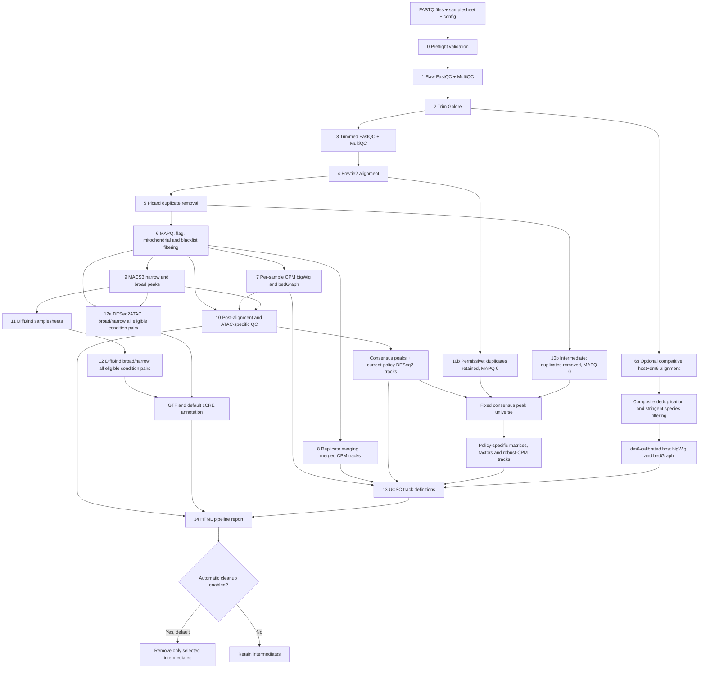

# ATACseq2tracks 4.2.0

ATACseq2tracks is a samplesheet-driven Bash workflow for bulk ATAC-seq and related chromatin-profiling assays. Version 4.2.0 adds an independently configurable Drosophila dm6 spike-in calibration branch to the cumulative v4.1.0 filtering-policy release. It retains the Bash architecture; it does not introduce Nextflow or Snakemake.

> Status: release candidate. All inherited v4.1.0 outputs remain enabled and unchanged. The new v4.2.0 spike-in family is off by default and requires representative paired-end and single-end server validation before biological interpretation. See [the v4.2.0 update note](docs/v4.2.0_DROSOPHILA_SPIKEIN_UPDATE_2026-08-20.md).

## Principal capabilities

- raw and trimmed FASTQ quality control with FastQC and MultiQC;
- Trim Galore adapter trimming for paired-end and single-end libraries;
- Bowtie2 alignment with per-sample logs, `flagstat`, and `samtools stats`;
- Picard duplicate removal;
- MAPQ, SAM-flag, mitochondrial, blacklist, and proper-pair filtering;
- fragment/read CPM bigWig and bedGraph tracks generated by default;
- MACS3 peak calling using `BAMPE` for paired-end ATAC-seq;
- a consensus peak set requiring support in at least two biological samples by default;
- DESeq2 size factors calculated from counts within the consensus peak set;
- DESeq2-consensus and permissive/intermediate/stringent DESeq2-robust-CPM bigWig/bedGraph tracks;
- optional stringent host coverage calibrated directly to retained dm6 spike-in fragments/reads after competitive host+dm6 alignment;
- deepTools QC: FRiP, fingerprints, PCA, correlations, signal heatmaps and chromosome coverage;
- ATAC-specific `ataqv` QC: ENCODE-style TSS enrichment and short/mononucleosomal ratio;
- full-scan paired-end fragment-size and nucleosome-periodicity metrics with PNG/PDF plots;
- DiffBind differential accessibility with configurable ATAC summit windows;
- independent DESeq2ATAC broad- and narrow-consensus differential analyses with
  raw fragment/read counts, complete result tables and PNG/PDF diagnostics;
- universal all-pair differential analysis for any number or names of conditions,
  while singleton conditions remain in consensus construction but not models;
- built-in GTF gene-context/nearest-TSS annotation and default genome-matched
  cCRE classification of complete consensus universes and differential results;
- concise pair-level TSV and HTML summaries with increased/decreased site counts;
- UCSC custom-track definitions;
- optional HOMER peak annotation and motif enrichment, disabled by default.

## Workflow overview



Steps are checkpointed and resume independently. DiffBind and DESeq2ATAC are
separate differential-accessibility analyses; normalized browser tracks are not
used as count input for either module. See [Pipeline stages](docs/06_pipeline_steps.md)
for the commands and files used at each stage.

## Important scientific definitions

### Consensus peaks

`CONSENSUS_MIN_SAMPLES=2` means that an interval must be supported by peaks from at least two distinct biological sample keys (`sample_id + replicate`). Technical-replicate rows are collapsed first. This is a practical support rule, not a substitute for IDR.

### Track normalization

Five inherited coverage families are produced by default and can be switched off independently:

- `bigwig/*_CPM.{bw,bedGraph}`: coverage divided by the number of canonical, filtered fragments (PE) or reads (SE), then multiplied by one million;
- `bigwig_deseq2_consensus/*_DESeq2Consensus.{bw,bedGraph}`: raw coverage multiplied by `1 / size_factor`;
- `bigwig_deseq2_robust_cpm/permissive/*_DESeq2RobustCPM_Permissive.{bw,bedGraph}`: duplicates retained and primary alignments retained at MAPQ 0;
- `bigwig_deseq2_robust_cpm/intermediate/*_DESeq2RobustCPM_Intermediate.{bw,bedGraph}`: Picard duplicates removed and primary alignments retained at MAPQ 0;
- `bigwig_deseq2_robust_cpm/stringent/*_DESeq2RobustCPM_Stringent.{bw,bedGraph}`: the current deduplicated, MAPQ 30 high-confidence policy.

For each robust policy, the cohort constant is `exp(mean(log(colSums(K_policy))))`. Every policy uses the same fixed consensus BED but receives its own count matrix, DESeq2 size factors and cohort constant. Within one policy, robust CPM is the corresponding DESeq2-consensus signal multiplied by one cohort-wide constant; it changes the units, not relative sample scaling. The permissive and intermediate families are sensitivity outputs, while stringent remains the primary default for interpretation. These tracks are visualization outputs and are not used as count input for differential testing.

When explicitly enabled, `bigwig_spikein/stringent/*_SpikeInDM6_Stringent.{bw,bedGraph}` is a sixth, independent family. Reads are competitively aligned once to a host+dm6 composite reference, duplicates are removed, and host/dm6 observations are restricted to primary canonical alignments at `SPIKEIN_MIN_MAPQ=30` with blacklist removal. Raw stringent host coverage is multiplied by `SPIKEIN_SCALE_TARGET × spikein_to_host_ratio / retained_dm6_observations`. It is not layered on DESeq2 robust-CPM, so library depth is not normalized twice. Use it only when dm6 material was added before tagmentation and the samplesheet declares valid spike-in metadata. It calibrates technical recovery; it does not remove study batch effects or make arbitrary studies absolutely comparable.

For paired-end data, one properly paired first-mate alignment represents each fragment and deepTools extends it across the insert. For single-end data, `SE_SIGNAL_MODE="read"` counts each retained alignment once and does not invent a fragment or extend the read. The same layout-specific unit is used for CPM, consensus-peak counts and every DESeq2-derived track family.

Run PE and SE libraries as separate analyses with separate samplesheets and output directories. Mixing them would combine fragment and read units in one normalization cohort. Tn5 insertion-site mode is not implemented in this update. Consensus construction, count estimation and every track use canonical autosomes plus X/Y only; mitochondrial, blacklist and noncanonical regions are excluded.

### TSS and fragment QC

`ataqv` calculates TSS enrichment from a strand-aware BED6 TSS file. Supply `TSS_BED_HG38` or `TSS_BED_MM39`, or leave it empty and the workflow will generate a TSS BED from the configured GTF.

For paired-end ATAC-seq, the workflow reports fragment fractions for:

- nucleosome-free: 1–100 bp;
- mononucleosome: 180–247 bp;
- dinucleosome: 315–473 bp;
- trinucleosome: 558–615 bp.

It also reports NFR/mononucleosome ratio, periodic-fragment fraction, local mono/di peak positions and peak spacing. Fragment periodicity is marked not applicable for single-end data.

## Repository layout

```text
ATACseq2tracks/
├── atacseq2tracks.sh              main entry point
├── fastq2tracks.sh                compatibility alias; identical entry point
├── VERSION                        authoritative runtime version
├── environment.yml                Conda environment
├── config/
│   ├── config.conf                configuration template
│   ├── config_temp.conf.template  identical safe template
│   ├── samplesheet_template.csv
│   ├── samplesheet_example_atac.csv
│   └── samplesheet_example_atac_se.csv
├── scripts/                       processing, QC and analysis modules
├── tests/check_bash_syntax.sh     Bash/Python static checks
└── docs/
    ├── README.md                  documentation index
    └── update_3.2.0/              update rationale, manifest and application guide
```

## Quick start

```bash
git clone https://github.com/MichalGd/ATACseq2tracks.git
cd ATACseq2tracks
mamba env create -f environment.yml
conda activate ATACseq2tracks

mkdir -p /path/to/project/config
cp config/config.conf /path/to/project/config/config.conf
cp config/samplesheet_example_atac.csv /path/to/project/config/samplesheet.csv
```

Edit both copied files, then validate the complete run configuration before
starting the workflow:

```bash
bash scripts/smoke_test.sh \
    /path/to/project/config/samplesheet.csv \
    /path/to/project/config/config.conf

bash atacseq2tracks.sh \
    --config /path/to/project/config/config.conf
```

Use `samplesheet_example_atac_se.csv` for a single-end run. PE and SE libraries,
and hg38 and mm39 libraries, must be submitted as separate runs. For background
execution, monitoring and recovery commands, follow the
[Quick start](docs/02_quickstart.md) and [Running and resume](docs/05_running.md)
guides.

## Installation

Linux or another Unix-like execution environment is required. Create the environment with Mamba or Conda:

```bash
mamba env create -f environment.yml
conda activate ATACseq2tracks
```

The environment includes Bowtie2, samtools, bedtools, FastQC, MultiQC, Trim Galore, Picard, MACS3, deepTools, `ataqv`, R, DESeq2 and DiffBind. The workflow currently expects `PICARD_JAR` and `BEDGRAPH_TO_BIGWIG` paths in the configuration; confirm these paths during preflight.

Set executable bits after copying from Windows:

```bash
chmod +x atacseq2tracks.sh fastq2tracks.sh scripts/*.sh scripts/*.py tests/*.sh
```

## Configuration

Copy the template outside the installed code directory and edit the copy:

```bash
mkdir -p /path/to/project/config
cp config/config.conf /path/to/project/config/config.conf
cp config/samplesheet_example_atac.csv /path/to/project/config/samplesheet.csv
```

For a single-end run, copy `config/samplesheet_example_atac_se.csv` instead. Do not combine PE and SE rows in one run.

For a dm6-calibrated run, start from
`config/samplesheet_example_atac_spikein.csv`, retain the three added spike-in
columns, and enable the module in the run configuration. Legacy 17-column
samplesheets remain valid when the module is disabled.

At minimum configure:

- `SAMPLESHEET` and `OUTPUT_DIR`;
- the Bowtie2 index, GTF, chromosome sizes and blacklist for the single genome used in the run;
- `PICARD_JAR` and `BEDGRAPH_TO_BIGWIG`;
- optionally a pre-built TSS BED and `UCSC_BIGDATA_URL_BASE`.

Important defaults:

```bash
MIN_MAPQ=30
REMOVE_MITO=true
CONSENSUS_PEAK_TYPE="narrow"
CONSENSUS_MIN_SAMPLES=2
ALLOW_SINGLE_SAMPLE_CONSENSUS=false
GENERATE_DESEQ2_CONSENSUS_TRACKS=true
GENERATE_CPM_TRACKS=true
GENERATE_DESEQ2_ROBUST_CPM_PERMISSIVE_TRACKS=true
GENERATE_DESEQ2_ROBUST_CPM_INTERMEDIATE_TRACKS=true
GENERATE_DESEQ2_ROBUST_CPM_STRINGENT_TRACKS=true
GENERATE_COVERAGE_BIGWIGS=true
GENERATE_COVERAGE_BEDGRAPHS=true
PERMISSIVE_MIN_MAPQ=0
INTERMEDIATE_MIN_MAPQ=0
DIFFBIND_SUMMITS=100
DIFFBIND_ALPHA=0.05
DIFFERENTIAL_CONDITION_ORDER=""
DIFFERENTIAL_MIN_ABS_LOG2FC=0
RUN_DESEQ2ATAC=true
DESEQ2ATAC_MIN_SAMPLES=2
DESEQ2ATAC_ALPHA=0.05
DESEQ2ATAC_BLOCK_COLUMN=""
DESEQ2ATAC_REFERENCE_CONDITION=""
RUN_SIMPLE_PEAK_ANNOTATION=true
RUN_CCRE_ANNOTATION=true
CCRE_BED_HG38="/path/to/GRCh38-cCREs-V4.bed.gz"
CCRE_BED_MM39="/path/to/encodeCcreCombined_mm39_sorted.bed"
SE_SIGNAL_MODE="read"
RUN_ATAQV_QC=true
GENERATE_ATAQV_VIEWER=true
QC_SAMPLE_PARALLEL_JOBS=4
ATAQV_PARALLEL_JOBS=4
TRACK_PARALLEL_JOBS=2
COVERAGE_FILTER_PARALLEL_JOBS=2
POOLED_MACS_PARALLEL_JOBS=2
MERGE_PARALLEL_JOBS=2
RUN_PEAK_ANNOTATION=false
RUN_MOTIF_ENRICHMENT=false
ENABLE_AUTOMATIC_CLEANUP=true
KEEP_NORMALIZATION_POLICY_BAMS=false
GENERATE_DROSOPHILA_SPIKEIN_STRINGENT_TRACKS=false
SPIKEIN_MIN_MAPQ=30
SPIKEIN_SCALE_TARGET=1000000
SPIKEIN_MIN_FRAGMENTS_FAIL=1000
SPIKEIN_MIN_FRAGMENTS_WARN=10000
SPIKEIN_PARALLEL_JOBS=2
KEEP_SPIKEIN_BAMS=false
```

The later-stage job limits are defaults and may be changed in any run
configuration. They control concurrent samples or groups; `THREADS_ATAQV`,
`THREADS_DEEPTOOLS`, `THREADS_BIGWIG`, and `THREADS_SAMTOOLS` remain the
per-process thread limits. Because BAM scans are often storage-bound, increase
job counts gradually rather than using every available CPU immediately. Older
run configurations that omit these variables automatically use the defaults
shown above.

Only one genome build and one sequencing layout may be processed in a run. Separate hg38/mm39 and PE/SE libraries into different runs.

## Running

```bash
bash atacseq2tracks.sh --config /absolute/path/to/project/config/config.conf
```

Step 0 performs preflight validation before processing data. Each completed stage writes a signature-based checkpoint to `<OUTPUT_DIR>/.checkpoints/`. To rerun Step 10 after changing QC configuration:

```bash
rm /path/to/output/.checkpoints/step10.done
bash atacseq2tracks.sh --config /absolute/path/to/project/config/config.conf
```

## Pipeline stages

| Step | Operation |
|---:|---|
| 0 | Preflight, dependency, samplesheet and reference validation |
| 1 | Raw FastQC and MultiQC |
| 2 | Trim Galore |
| 3 | Trimmed FastQC and MultiQC |
| 4 | Bowtie2 alignment |
| 5 | Picard deduplication |
| 6 | MAPQ/flag, mitochondrial and blacklist filtering |
| 6s | Optional competitive host+dm6 alignment, composite deduplication, stringent split/filtering and dm6-calibrated tracks |
| 7 | Per-sample fragment/read CPM bigWig and bedGraph tracks |
| 8 | Biological-group merging and merged CPM tracks |
| 9 | Layout-aware MACS3 peak calling |
| 10 | deepTools QC, consensus peaks, DESeq2 track scaling, TSS enrichment and periodicity QC |
| 10b | Permissive/intermediate filtering, policy-specific matrices and robust-CPM tracks |
| 11 | DiffBind samplesheet preparation |
| 12 | DiffBind differential accessibility (`summits=100` by default) |
| 12a | Independent DESeq2ATAC broad- and narrow-consensus analyses |
| 13 | UCSC custom-track definitions |
| 14 | MultiQC pipeline report |

## Principal outputs

```text
<OUTPUT_DIR>/
├── bigwig/                             *_CPM.{bw,bedGraph}
├── bigwig_deseq2_consensus/            *_DESeq2Consensus.{bw,bedGraph}
├── bigwig_deseq2_robust_cpm/           legacy stringent aliases
│   ├── permissive/                     *_DESeq2RobustCPM_Permissive.{bw,bedGraph}
│   ├── intermediate/                   *_DESeq2RobustCPM_Intermediate.{bw,bedGraph}
│   └── stringent/                      *_DESeq2RobustCPM_Stringent.{bw,bedGraph}
├── coverage_filtering_sensitivity/     matrices, factors and combined metadata
├── bigwig_spikein/stringent/           *_SpikeInDM6_Stringent.{bw,bedGraph}
├── spikein/tables/                     calibration, QC warnings and provenance
├── bigwig_merged/                      merged CPM tracks
├── filteredBams/                       quantitative analysis BAMs
├── peaks/per_replicate/                MACS3 narrow/broad peaks
├── qc_post_alignment/
│   ├── tables/qc_summary.tsv
│   ├── tables/frip_consensus.tsv
│   ├── matrices/consensus_peak_counts.tsv
│   ├── tables/consensus_sizeFactors.tsv
│   ├── tables/track_normalization_metadata.tsv
│   ├── peak_sets/consensus_peaks.bed
│   ├── tables/parallel_job_timing.tsv
│   └── atac_qc/
│       ├── tables/ataqv_selected_metrics.tsv
│       ├── tables/nucleosome_periodicity_metrics.tsv
│       ├── tables/ataqv_job_timing.tsv
│       ├── plots/*.fragment_length_periodicity.{png,pdf}
│       ├── ataqv_metrics/*.ataqv.json.gz
│       └── ataqv_viewer/
├── diffbind/
├── diffbind_results/
├── deseq2atac/
│   ├── broad/
│   ├── narrow/
│   └── deseq2atac_peak_type_summary.tsv
└── reports/
    ├── differential_accessibility_summary.tsv
    └── differential_accessibility_summary.html
```

The `deseq2atac/broad/` and `deseq2atac/narrow/` directories contain fully
separate support-filtered consensuses, matrices, DESeq2 models, results, metadata,
summaries and PNG/PDF figures. The top-level
`deseq2atac_peak_type_summary.tsv` records their completion status. Each peak
type has `comparisons/<comparison_id>/`; for `k` conditions with at least two
biological samples, all `k*(k-1)/2` pairs are exported. All samples, including
singleton-condition samples, contribute to consensus construction. See
the differential-accessibility documentation for the exact consensus algorithm
and its distinction from DiffBind. The exact annotation columns, category rules,
reference provenance and interpretation limits are documented in
[Peak annotation](docs/16_peak_annotation.md).

cCRE classification is required by default. Preflight verifies the reference
for the selected genome. On a server without that reference, set
`RUN_CCRE_ANNOTATION=false`; GTF gene-context and nearest-TSS annotation remains
enabled for every consensus peak.

Prepare the native hg38 ENCODE4 reference with:

```bash
bash utilities/prepare_encode4_hg38_ccre.sh
```

The utility validates the complete official registry and installs it at the
default `CCRE_BED_HG38` location with checksum/provenance metadata. See
[Reference file preparation](docs/10_reference_files.md).

Each bigWig directory receives `ucsc_tracks.txt`. With `UCSC_BIGDATA_URL_BASE` unset, entries use relative filenames; configure a public HTTP(S) base URL for direct UCSC loading.

## Storage cleanup

Automatic cleanup is enabled by default and runs only after the entire workflow
succeeds. It removes trimmed FASTQs, alignment BAMs, pre-blacklist deduplicated
BAMs and raw bedGraphs under the default `KEEP_*` policy. Filtered quantitative
BAMs and every final track, peak, QC, differential result and report are retained.
Temporary permissive/intermediate policy BAMs are removed by default through
`KEEP_NORMALIZATION_POLICY_BAMS=false`, after their matrices, factors, metadata
and tracks have completed successfully.
Spike-in composite/deduplicated/host/dm6 BAM intermediates are likewise removed
after full success unless `KEEP_SPIKEIN_BAMS=true`; spike-in tracks, calibration
metadata, QC warnings and provenance are retained.
Set `ENABLE_AUTOMATIC_CLEANUP=false` before a run to keep every intermediate for
troubleshooting or planned partial-stage reruns. Compact histograms are stored
instead of per-fragment text tables, and `ataqv` metrics use compressed JSON.

## Validation before biological use

Run static checks:

```bash
bash tests/check_bash_syntax.sh
```

Then execute small PE-only and SE-only datasets with at least two biological samples and confirm:

- filtered BAMs pass `samtools quickcheck`;
- CPM, DESeq2-consensus and DESeq2-robust-CPM bigWigs are non-empty;
- CPM and every enabled DESeq2 bigWig/bedGraph family are non-empty;
- permissive, intermediate and stringent metadata report the expected retained-fragment ordering and the same consensus BED checksum;
- the consensus set applies the configured minimum support;
- TSS enrichment and fragment-periodicity tables are populated;
- PE MACS3 logs show `BAMPE`;
- SE MACS3 logs show `BAM --nomodel` with the configured shift/extension, while SE normalization metadata reports `signal_unit=read`;
- DiffBind outputs use the configured summit width and contain the requested contrasts and diagnostics;
- both DESeq2ATAC raw and normalized matrices are readable, their result tables
  retain `NA` adjusted P-values, and paired-end fragments are counted once;
- a deliberately failed child process makes its stage exit non-zero.
- when spike-in mode is enabled, composite indices contain all six Bowtie2
  components, dm6 counts exceed the hard threshold, both spike-in track formats
  are non-empty, and `applied_scale = target × declared_ratio / dm6_count`;
- computational downsampling of the same library gives stable calibrated host
  signal within sampling error, while intentionally altered host:dm6 mixtures
  change the scale in the expected direction.

## Documentation

| If you need to... | Read... |
|---|---|
| Install and launch a first run | [Quick start](docs/02_quickstart.md) and [Installation](docs/03_installation.md) |
| Prepare the samplesheet and configuration | [Inputs](docs/04_inputs.md) and [Reference files](docs/10_reference_files.md) |
| Run, monitor, resume or rerun a stage | [Running and resume](docs/05_running.md) |
| Understand each processing stage | [Pipeline stages](docs/06_pipeline_steps.md) |
| Find and interpret generated files | [Outputs](docs/07_outputs.md) |
| Review QC metrics | [Post-alignment QC](docs/12_post_alignment_qc.md) |
| Design or interpret differential analysis | [Differential accessibility](docs/13_differential_accessibility.md) and [Replicates and design](docs/14_replicates_and_experimental_design.md) |
| Interpret gene-context and cCRE annotations | [Peak annotation](docs/16_peak_annotation.md) |
| Diagnose a failure | [Troubleshooting](docs/09_troubleshooting.md) |
| Review or deploy v4.2.0 | [dm6 spike-in scope and validation](docs/v4.2.0_DROSOPHILA_SPIKEIN_UPDATE_2026-08-20.md) and [application guide](APPLY_V4.2.0_DROSOPHILA_SPIKEIN_UPDATE_2026-08-20.md) |
| Review inherited v4.1.0 behavior | [Filtering-policy scope and validation](docs/v4.1.0_READ_FILTERING_COVERAGE_UPDATE_2026-08-20.md) |
| Review the corrected v4.0.0 release | [Hotfix scope and validation](docs/v4.0.0_REPORTING_DIFFBIND_HOTFIX_2026-08-20.md), [application guide](APPLY_V4.0.0_REPORTING_DIFFBIND_HOTFIX_2026-08-20.md) and [manifest](V4.0.0_REPORTING_DIFFBIND_HOTFIX_MANIFEST_2026-08-20.tsv) |
| Review the original v4.0.0 release scope | [Release scope and validation](docs/v4.0.0_RELEASE_2026-08-19.md), [application guide](APPLY_V4.0.0_2026-08-19.md) and [manifest](V4.0.0_MANIFEST_2026-08-19.tsv) |
| Review historical v3.2.0 updates | [Scope](docs/update_3.2.0/MINIMAL_CRITICAL_IMPROVEMENTS.md), [application checks](docs/update_3.2.0/APPLY_UPDATE.md) and [manifest](docs/update_3.2.0/UPDATE_MANIFEST.md) |

The complete page list is in the [documentation index](docs/README.md).

## Known limitations

- Bash CSV parsing remains simple; avoid embedded commas in fields.
- Consensus support ≥2 is not formal IDR.
- PE and SE libraries cannot share one normalization cohort; run them separately.
- SE data cannot provide observed fragment lengths or nucleosome-periodicity metrics; the supported SE signal unit is one retained read.
- Differential inference requires biological replication and a valid, non-confounded design.
- Conditions with fewer than two biological samples are excluded from
  differential models but still participate in consensus construction and all
  non-differential stages.
- DESeq2ATAC requires non-empty broad and narrow peak files for every biological
  sample; set samplesheet `macs2_mode=both`.
- DESeq2 consensus scaling assumes most counted accessible regions do not undergo a coordinated global shift. Use spike-in or another explicit calibration strategy when global accessibility changes are expected.
- dm6 calibration is valid only when spike-in material was added consistently before tagmentation; post-library mixing cannot recover upstream technical losses.
- Low dm6 counts produce unstable scale factors. The hard and warning thresholds are safeguards, not universal biological QC cutoffs.
- Composite-alignment MAPQ is reference- and aligner-dependent; highly homologous host/fly reads are excluded by the stringent threshold but cannot be assigned with certainty.
- Neither dm6 nor DESeq2 normalization corrects arbitrary laboratory, protocol, genome-build or biological batch effects.
- The new v4.2.0 spike-in branch and inherited v4.1.0 filtering-policy branches require representative PE/SE server validation before production interpretation.

See [CHANGELOG.md](CHANGELOG.md) for release history.
