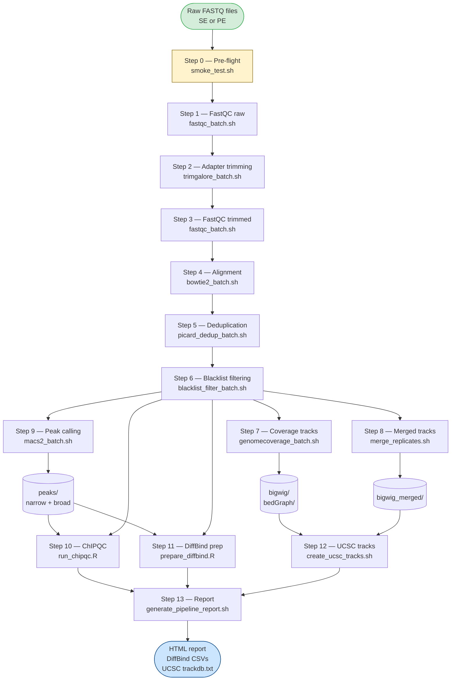

# 01 — Overview

[← Index](README.md) | [Next: Quick start →](02_quickstart.md)

---

## What is fastq2tracks?

**fastq2tracks** is a modular, checkpoint-resumable pipeline that converts raw FASTQ files from chromatin-profiling assays into analysis-ready outputs:

- Normalised **bigwig tracks** for genome browsers (individual replicates and merged)
- **MACS2 peaks** in both narrow and broad format for every IP sample
- **ChIPQC** quality reports with FRiP scores and coverage metrics
- **DiffBind-ready samplesheets** for differential binding analysis

A single **CSV samplesheet** describes every sample. A single **config file** sets all paths and parameters. The pipeline runs as a single bash command and can be safely interrupted and resumed — each step writes a checkpoint file, and completed steps are skipped on rerun.

---

## Supported assay types

| Assay | Notes |
|---|---|
| ChIP-seq | Primary target. SE and PE. hg38 and mm39. |
| ATAC-seq | Supported. Use `macs2_mode=both`; adjust fragment size in config. |
| CUT&RUN | Supported. Typically narrow peaks only. |
| CUT&TAG | Supported. Similar to CUT&RUN. |

---

## Workflow overview

---

## Design principles

| Principle | Implementation |
|---|---|
| **Single entry point** | `fastq2tracks.sh --config config.conf` runs everything |
| **No hardcoded paths** | All paths and parameters in `config/config.conf` |
| **Safe resume** | `.checkpoints/stepN.done` flags; failed/removed steps rerun |
| **Mixed genomes** | hg38 and mm39 rows can coexist in one samplesheet |
| **SE and PE** | Read layout per sample via samplesheet column `layout` |
| **Replicate tracking** | Biological and technical replicates explicit in samplesheet |
| **Control linkage** | `control_id` column links each IP to its input |

---

## fastq2tracks vs rnaseq2tracksP

Both pipelines share the same samplesheet-driven, config-file-parameterised, checkpoint-resumable design and can be run on samples from the same experiment.

| Feature | **fastq2tracks** | **rnaseq2tracksP** |
|---|---|---|
| Assay | ChIP-seq, ATAC-seq, CUT&RUN, CUT&TAG | RNA-seq |
| Aligner | Bowtie2 (gapped-free) | STAR / HISAT2 (splice-aware) |
| Duplicate removal | Picard MarkDuplicates | Optional |
| Peak calling | MACS2 narrow + broad | — |
| QC module | ChIPQC (FRiP, TSS enrichment) | RSeQC / MultiQC |
| Track normalisation | Library-size / spike-in | TPM / CPM |
| Downstream prep | DiffBind samplesheets | DESeq2 / edgeR count matrices |
| Genome support | hg38, mm39 | hg38, mm39 |
| Config system | `config.conf` (bash source) | `config.conf` (bash source) |

---

[← Index](README.md) | [Next: Quick start →](02_quickstart.md)
