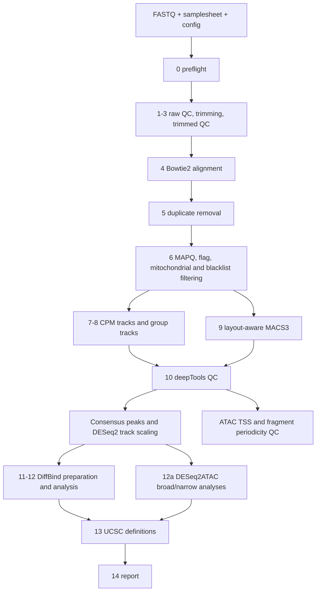

# 01 — Overview

[← Index](README.md) | [Next: Quick start →](02_quickstart.md)

ATACseq2tracks 3.2.0 is a modular, checkpoint-resumable Bash workflow for bulk ATAC-seq and related chromatin-profiling assays. One CSV samplesheet describes the libraries and one sourced configuration file defines run paths, references, tools and resource limits.

## Main outputs

- filtered and indexed analysis BAMs;
- filtered-BAM fragment/read CPM bigWigs for genome browsers;
- separate DESeq2 consensus and robust-CPM bigWig/bedGraph families;
- per-sample and pooled MACS3 peaks;
- support-filtered consensus peaks, defaulting to support in at least two biological samples;
- deepTools FRiP, fingerprint, PCA, correlation, chromosome-coverage and peak-profile QC;
- ATAC-specific TSS enrichment and paired-end nucleosome-periodicity QC;
- consensus-peak raw counts and DESeq2 size factors;
- DiffBind differential accessibility results and diagnostic figures;
- independent broad- and narrow-consensus DESeq2ATAC results and PNG/PDF diagnostics;
- UCSC custom-track definitions and a MultiQC report.

## Supported inputs

| Property | Support |
|---|---|
| Genome | hg38 or mm39; one genome per run |
| Layout | Paired-end and single-end, in separate layout-specific runs |
| ATAC-seq | Primary v3.2 focus; PE recommended |
| ChIP-seq, CUT&RUN, CUT&Tag, ChIPmentation | Core alignment, tracks, peaks and general QC supported; ATAC-only metrics run only for assay values beginning with `ATAC` |
| Input/control | Optional; standard bulk ATAC-seq does not require one |
| Replication | Technical rows are collapsed into biological sample keys; biological replication is required for valid differential inference |

## Workflow sequence

## Design principles

| Principle | Implementation |
|---|---|
| Single entry point | `atacseq2tracks.sh --config /absolute/path/config.conf` |
| Explicit failure | Failed child jobs make their stage fail |
| Safe resume | Checkpoint signatures cover samplesheet, configuration and version |
| Quantitative separation | Raw integer peak counts feed DESeq2/DiffBind; normalized tracks are visualization outputs |
| Shared signal semantics | PE fragments are counted once; SE reads remain read-based; all normalization uses canonical autosomes plus X/Y |
| Layout-specific cohorts | A run contains PE or SE libraries, not both; this avoids combining fragment and read units in one DESeq2 cohort |
| Replicate-aware consensus | Support is counted across distinct biological sample keys |
| Auditable filtering | Per-sample attrition metrics accompany filtered BAMs |
| Storage safety | Automatic cleanup is disabled until explicitly enabled after successful analysis |

## Limitations

- Bash CSV parsing is intentionally simple; fields containing embedded commas are unsupported.
- Support in two samples is not formal IDR.
- Single-end data cannot provide reliable fragment-size periodicity.
- SE normalization uses one retained read per observation (`SE_SIGNAL_MODE="read"`); no pseudo-fragments or Tn5 tracks are generated.
- Ordinary DESeq2 normalization may be inappropriate when a coordinated global accessibility shift is expected; use an explicit calibration strategy.

[← Index](README.md) | [Next: Quick start →](02_quickstart.md)
