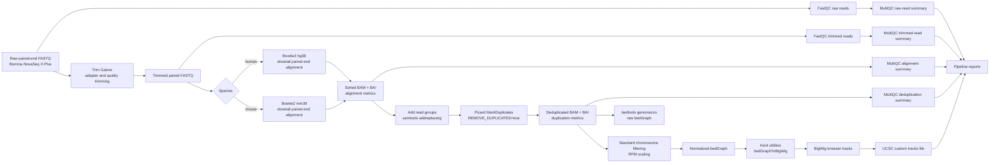

# Workflow description

## Purpose

The workflow maps paired-end Illumina genomic DNA reads to a reference genome and converts the results into files that are useful for quality control, downstream inspection, and genome-browser visualization.

The current repository supports two species modes in the master script:

- `human`: uses an hg38 Bowtie2 index and hg38 chromosome sizes.
- `mouse`: uses an mm39 Bowtie2 index and mm39 chromosome sizes.

## End-to-end flow



## Step 1. Create output folders

The master script creates the expected analysis tree under the user-provided output folder:

```text
reports/
fastQC/fastQC_unTrimmed/
fastQC/fastQC_trimmed/
multiQC/multiQC_unTrimmed/
multiQC/multiQC_trimmed/
multiQC/multiQC_alignments/
multiQC/multiQC_deduplication/
trimmedFastq/
bams/
dedupBams/
bedGraph/
NormBedGraph/
bigwig/
```

## Step 2. Raw FASTQ QC

`scripts/fastqc_batch.1.0.sh` scans the raw input folder for compressed FASTQ files and runs FastQC. It writes individual FastQC outputs and batch logs. The master script then uses MultiQC to summarize the raw-read QC results.

## Step 3. Adapter and quality trimming

`scripts/trimgalore_batch.1.0.sh` runs Trim Galore in paired-end mode. It expects R1 and R2 files and writes trimmed read pairs to `trimmedFastq/`. The script is designed for continuous job replacement: when one sample finishes, the next sample starts.

## Step 4. Trimmed FASTQ QC

The workflow runs FastQC again on the trimmed FASTQ files. A second MultiQC report summarizes whether trimming improved adapter content, read lengths, per-base quality, GC distribution, and other QC modules.

## Step 5. Bowtie2 alignment

The master script selects a species-specific batch wrapper:

- `bowtie2_human_batch.2.1.sh` for human.
- `bowtie2_mouse_batch.2.1.sh` for mouse.

Each wrapper dispatches the corresponding single-sample mapper:

- `bowtie2_dovetail_pairedEnd_Hsapiens.2.1.sh`
- `bowtie2_dovetail_pairedEnd_MMusculus.2.1.sh`

The single-sample Bowtie2 scripts use dovetail paired-end mapping with `--minins 20`, `--maxins 1200`, `--dovetail`, `--phred33`, `--no-unal`, and 12 threads. SAM output is converted to BAM, sorted, indexed, and moved into the `bams/` folder.

## Step 6. Add read-group tags and remove duplicates

Before deduplication, the master script adds a read group with `samtools addreplacerg`. Picard then removes duplicates through:

- `picard_deduplication_batch.2.1.sh`
- `picard_deduplication.2.1.sh`

The Picard script uses `MarkDuplicates`, `REMOVE_DUPLICATES=true`, coordinate sort order, a 32 GB Java heap, and index creation.

## Step 7. Coverage generation and normalization

`genomecoverage_batch.1.0.sh` dispatches either the human or mouse coverage script. The lower-level coverage scripts:

1. Index the deduplicated BAM.
2. Create a standard-chromosome BAM subset.
3. Generate raw bedGraph coverage.
4. Count standard-chromosome reads.
5. Calculate an RPM-like scaling factor as `1e6 / readsNumber`.
6. Generate scaled bedGraph coverage.
7. Sort normalized bedGraph output.
8. Convert normalized bedGraph to BigWig using Kent utilities.

Human coverage uses chromosomes `chr1` to `chr22`, `chrX`, and `chrY`. Mouse coverage uses `chr1` to `chr19`, `chrX`, and `chrY`.

## Step 8. UCSC custom tracks

`create_ucsc_tracks.1.0.sh` scans the `bigwig/` folder and writes:

- `ucsc_tracks.txt`: UCSC Genome Browser custom-track lines.
- `bigwig_summary.txt`: track number, filename, sample name, and file size summary.

The user must replace the placeholder remote URL with the actual public URL where the BigWig files are hosted.

## Step 9. Pipeline execution report

`generate_pipeline_report.1.0.sh` creates an R Markdown report and renders it to HTML, PDF, or both. The master workflow calls it in HTML mode.

The generated report includes system information, software version checks, expected resource usage, output directory summaries, log summaries, and a file inventory.

## Step 10. Unified MultiQC report

`generate_multiqc_unified_report.1.0.sh` builds a portable HTML report that combines key MultiQC tables and available PNG plots from the output tree. It supports:

- `selfcontained`: embeds images into a single HTML file.
- `assets`: writes HTML plus an adjacent assets folder.

The master script calls this report generator in `selfcontained` mode.

## Restart or partial workflow mode

`fastq2tracks.2.1_blocked.sh` is a partial or restart-oriented variant. Raw FastQC, trimming, trimmed FastQC, and some MultiQC steps are commented out, so it expects existing trimmed reads and starts mainly from alignment onward. Use it only when prerequisite folders and files already exist.
